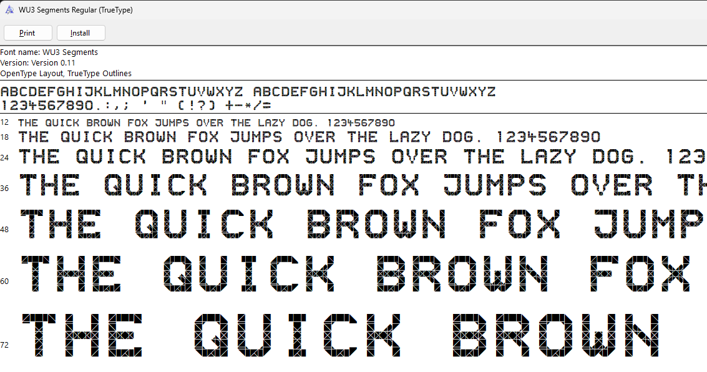
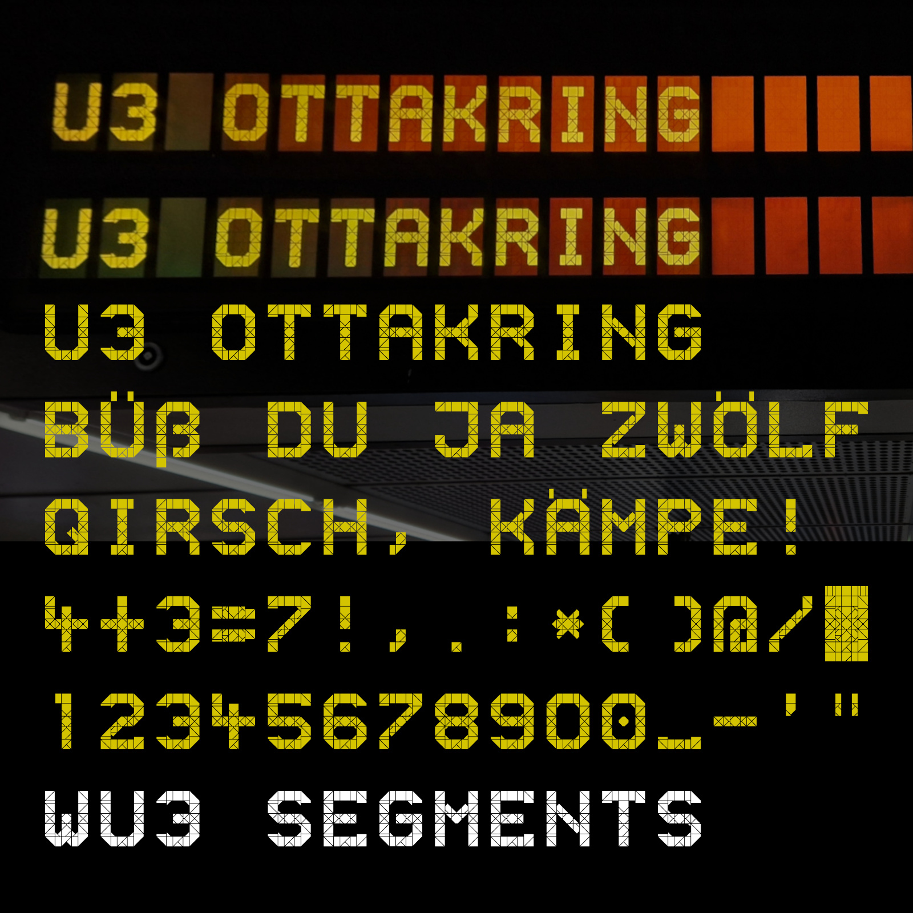

# WU3 Segments

An open source font based on the displays used on the U3 subway line in Vienna.

Download it here: https://github.com/gheja/wu3-segments/releases/

Note: this font is still work in progress.

## About

When I first visited Vienna and saw a display in the U3 subway and
immediately noticed how many segments there were. After thinking "this
must be way too many" I started to really like it and next time I took
a few pictures and [wanted to see all the characters](https://mastodon.social/@gheja/113012797551894562).
A bit later I [drew the segments in Inkscape](https://mastodon.social/@gheja/113138822732431374)
and played around with the idea of making a font out of it. It was
received surprisingly well on Mastodon, this gave me the push to
[really start to create the font](https://mastodon.social/@gheja/113215721872127696).

The name WU3 Segments comes from Wien U3 and the fact that it consists
of segments. I'm not really sure if it is used elsewhere as well but
I will stick with this name.

I probaly should write Wien Subway Font and Vienna U-Bahn Font here,
just for SEO reasons :)

## Sources

The LCD segments are based on my own works (photos taken on subway
stations), the shape of the characters are based on or inspired by own
works and photos found online, details follow.

  - `A` `E` `G` `I` `K` `M` `N` `O` `R` `S` `T` `U` `1` `2` `3` `4` `5` `8` `_` `*` \
  Own work

  - `9` `0` `J` `Q` `X` `Y` `ß` `"` `'` `(` `)` `+` `.` `:` `;` `?` `@` `/` `-` `<` `>` `=` `&` `#` `$` `%` \
  Own work, guesses based on other characters

  - `C` `H` `L` `F` `Z` `Ö` `Ü` `!` `,` \
  [Wiener Linien crashen Echtzeitanzeige mit "Klima schützen"](https://futurezone.at/digital-life/wiener-linien-crashen-echtzeitanzeige-mit-klima-schuetzen/400507669)
  by Future Zone

  - `D` \
  [Photo](https://www.eguana.at/2022/02/wien-ist-anders/)
  by eguana

  - `P` \
  [Wien, U-Bahn der Wiener Linien. Die Wiener Linien GmbH und Co KG - kurz WL, bis zum 11. Juni 1999 Wiener Stadtwerke, Ve](https://www.diepresse.com/6216358/warum-noch-immer-maskenpflicht-in-der-u-bahn)
  by IMAGO/Manfred Segerer (IMAGO/Manfred Segerer)

  - `V` `W` \
  [Photo](https://wien.orf.at/stories/3056016/)
  by wien.ORF.at

  - `6` \
  [Burggasse Stadthalle metro station central Vienna Austria central Europe](https://www.alamy.com/stock-photo-burggasse-stadthalle-metro-station-central-vienna-austria-central-37481604.html)
  by Peter Forsberg / Europe / Alamy Stock Photo

  - `B` \
  [Betriebsstörung der U3](https://www.heute.at/s/ersatzbus-rangelei-nach-stoerung-der-u3-100280980)
  by zVg

  - `7` \
  [Stations (46/59)](https://imhd.sk/transport/gallery-media/584/Stations/81718/Route-U3-Zieglergasse)
  by Andreas Papadopulos
